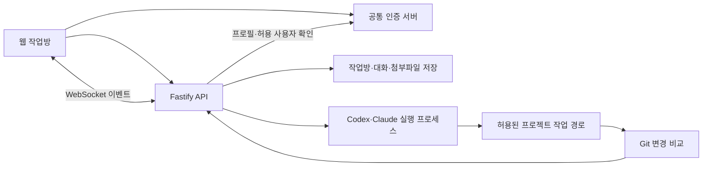

# AI Coding Workspace

**브라우저에서 이어서 사용하는 개인용 AI 개발 워크스페이스**

서버에서 Codex·Claude 같은 AI 코딩 에이전트를 실행하고, 프로젝트별 작업방에서 코드 작성·오류 분석·파일 수정·문서 제작을 요청할 수 있도록 개발했습니다. 대화와 첨부파일·작업 이력을 서버에 보관하여 브라우저를 닫은 뒤에도 이전 작업을 이어갈 수 있습니다.

[실행과 환경 설정](docs/SETUP.md) · [공통 인증 서버](https://github.com/ho72/unified-auth-server)

## 주요 기능

| 기능 | 구현 내용 | 코드 |
| --- | --- | --- |
| 프로젝트별 작업방 | 작업 경로·에이전트 선택, 방 생성·정렬·고정 | [서버](src/server.js), [방 정렬](public/room-order.js) |
| 에이전트 실행 | Codex app-server와 Claude 스트림 출력을 방별 이벤트로 처리 | [실행·이벤트 처리](src/server.js) |
| 작업 지속성 | 대화 이벤트 저장·재조회, 작업방 보관·복원·휴지통·삭제 | [서버](src/server.js), [방 상태](public/room-state.js) |
| 첨부·결과물 | 파일 업로드·열람·다운로드, 생성 이미지와 파일 링크 처리 | [첨부 처리](src/assistant-images.js), [웹 화면](public/app.js) |
| 파일 변경 확인 | Git 상태·diff를 작업 시작 시점과 비교해 변경 파일 표시 | [변경 비교](src/workspace-changes.js) |
| 인증·실행 범위 | 공통 계정 검증, 허용 사용자 목록, 자체 세션, 허용 작업 경로 설정 | [인증·경로 처리](src/server.js) |

## 기술 구성

- **서버:** Node.js, JavaScript ESM, Fastify 5
- **웹:** Vanilla JavaScript, HTML/CSS, xterm.js
- **실시간 연결:** WebSocket, 에이전트 프로세스의 표준 입출력
- **저장:** 파일 시스템 기반 작업방·이벤트·첨부파일 저장
- **인증:** 공통 인증 서버 프로필 검증과 자체 서명 세션 쿠키

## 구조와 설계



- 에이전트마다 다른 출력 형식을 웹 작업방의 이벤트로 정규화하고, 파일에 저장한 이벤트를 브라우저에 다시 전달합니다.
- 작업방의 ID와 에이전트 세션 ID를 관리하여, 저장한 작업방과 에이전트 대화를 이어서 사용할 수 있도록 구성합니다. 브라우저 종료와 작업방 보관·프로세스 종료는 각각 별도의 상태입니다.
- 서버에 접근할 수 있는 공통 계정과 에이전트가 작업할 디렉터리를 설정으로 제한합니다. 개인 서버의 허용 사용자용 도구이며, 작업 실행 권한은 서버 프로세스·에이전트 계정의 권한을 따릅니다.

```text
src/server.js             인증, 작업방 API, 에이전트 실행·이벤트 처리
src/assistant-images.js   생성 이미지·파일 경로 처리
src/workspace-changes.js  Git 상태·diff 비교
public/                   웹 화면·작업방 상태·정렬
test/                     헬퍼 함수 테스트
devai.service             systemd 배포 예시
.env.example              환경 설정 예시
```

## 실행

Node.js 20 이상이 필요하며, 검증에는 Node.js 22.22.2를 사용했습니다. 실제 코딩 작업에는 서버의 Codex·Claude 실행 환경과 계정 인증이 별도로 필요합니다.

```bash
git clone https://github.com/ho72/ai-coding-workspace.git
cd ai-coding-workspace
npm ci
cp .env.example .env
```

`DEVAI_SESSION_SECRET`, 허용 사용자 목록과 작업 경로를 설정한 뒤 실행합니다. 자세한 조건은 [실행 안내](docs/SETUP.md)를 참고하세요.

```bash
npm start
```

웹은 `http://localhost:4050`, 상태 확인은 `/healthz`입니다. 브라우저의 로그인은 공통 인증 서버를 사용합니다.

## 확인한 범위

임시 허용 계정으로 자체 세션 발급, 인증 전 접근 차단, 빈 작업방 생성·보관·복원·조회, 허용 경로 밖 작업방 거부와 로그아웃을 확인했습니다. 이 연결 검증에서는 에이전트 프로세스를 실행하지 않았습니다.

2026-10-06 공개 코드 기준으로 기존 `npm test` **15개가 통과**했고, 서버·웹 JavaScript 문법 검사도 통과했습니다. 테스트는 이미지·첨부 경로 처리, 방 정렬·상태, Git diff 비교를 확인합니다.

```bash
npm test
```

실제 에이전트의 작업 수행·세션 재개·모델 응답은 서버 CLI와 계정 환경에 의존하며 이번 검증에서 실행하지 않았습니다. 대화 이력·첨부파일·개인 프로젝트 결과물·에이전트 계정 설정은 저장소에 포함하지 않습니다.

## 함께 사용하는 서비스

| 저장소 | 역할 |
| --- | --- |
| [unified-auth-server](https://github.com/ho72/unified-auth-server) | 공통 계정·소셜 로그인·토큰 발급 |
| [home-media-sharing](https://github.com/ho72/home-media-sharing) | 사진·영상·파일 공유 |
| [smart-home-manager](https://github.com/ho72/smart-home-manager) | 스마트홈 기기·자동화 관리 |
